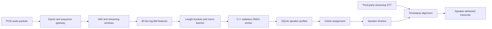

# CueBee Speaker Serving

CueBee Speaker Serving is a real-time, multi-tenant speaker diarization service for
producing a stable answer to “who spoke when.” It combines Voice Activity Detection
(VAD), log-Mel filter-bank extraction, cross-session micro-batching, speaker embeddings,
online centroid assignment, and Speech-to-Text (STT) timestamp alignment.

The embedding model is not an Automatic Speech Recognition (ASR) model and is not an
end-to-end diarization model. The production C++ backend uses Open Neural Network Exchange
(ONNX) Runtime and is designed for
`3dspeaker_speech_eres2net_sv_en_voxceleb_16k.onnx`, whose input is `[N,T,80]` and output
is a 192-dimensional embedding. Text continues to come from a third-party streaming STT
service.

## What is implemented

- Session epoch and sequence admission with retransmit deduplication and gap reporting.
- Streaming signed 16-bit Pulse-Code Modulation (PCM) decode, energy VAD, overlapping
  chunk assembly, and 80-bin log-Mel features.
- A C++17 stateless worker with a bounded length-prefixed binary protocol, ONNX Runtime
  session execution, batch padding, output validation, and length normalization.
- A persistent Python worker client with startup handshake, request correlation, timeout,
  clean shutdown, and one-process crash recovery attempt.
- A clearly labeled deterministic C++ engine and Python fallback for development tests.
- Short, medium, and long feature buckets; Earliest Deadline First (EDF) batch selection;
  an 80 ms default maximum wait; and a per-session batch limit.
- Tenant-isolated in-memory and SQLite stores for speaker centroids, stable identifiers,
  quality history, and display names.
- Quality-gated nearest-centroid assignment with weighted online centroid updates.
- Word-level STT alignment by timeline overlap, including speaker-boundary splitting.
- Audio-backlog autoscaling recommendations using Real-Time Factor (RTF), queue delay,
  hysteresis, and cooldown.
- Newline-Delimited JSON (NDJSON) streaming gateway, metrics, synthetic demo, load
  generator, multi-architecture container image, and Python/C++/cross-language tests.

This repository implements the Speaker Serving scope only. It does not implement CueBee's
separate stateful Large Language Model (LLM) runtime work.

## Architecture



Inference workers never own authoritative speaker identities. A restarted worker can load
the same session centroids from the state store and continue emitting `spk_001`,
`spk_002`, and so on. A user-facing name such as Alice is separate metadata and does not
rewrite the stable identifier.

See [architecture.md](docs/architecture.md) for invariants and failure behavior,
[protocol.md](docs/protocol.md) for the gateway contract, and
[native-worker-protocol.md](docs/native-worker-protocol.md) for the Python-to-C++ wire
format.

## Quick start

Python 3.9 or newer is supported.

```bash
python3 -m venv .venv
source .venv/bin/activate
python -m pip install -e .
cuebee-speaker-demo
```

The demo synthesizes three turns in the order Alice → Bob → Alice, sends 100 ms PCM
packets through the real frontend and batching path, assigns stable speaker identifiers,
and aligns word-timestamped STT. Its output is explicitly labeled as a functional demo,
not a diarization-accuracy measurement.

Run the test suite without installing test-only packages:

```bash
PYTHONPATH=src python -m unittest discover -s tests -v
```

## Run the streaming service

Without a model path, the server uses the deterministic development backend. This mode is
for protocol, scheduling, recovery, and integration work only.

```bash
PYTHONPATH=src python -m cuebee_speaker.server \
  --host 127.0.0.1 \
  --port 8765 \
  --state-db runtime/speaker-state.sqlite3
```

Each connection sends one JSON object per line. Audio payloads are base64-encoded mono
16 kHz PCM. Example health request:

```json
{"type":"health"}
```

The server is intended to sit behind an authenticated, Transport Layer Security (TLS)
terminating edge proxy. The protocol requires `tenant_id`, but the local server does not
itself authenticate that value.

## Build the C++ worker

The protocol, process supervision path, and deterministic test engine do not require ONNX
Runtime:

```bash
cmake -S . -B build/native -DCUEBEE_ENABLE_ONNX=OFF -DCMAKE_BUILD_TYPE=Release
cmake --build build/native --parallel
ctest --test-dir build/native --output-on-failure

PYTHONPATH=src python -m cuebee_speaker.server \
  --native-worker build/native/cpp/cuebee-speaker-worker \
  --native-backend deterministic
```

The deterministic engine is not a speaker model. This build is for protocol, scheduling,
crash recovery, and cross-language integration tests.

## Use the real ERes2Net model

Model binaries and third-party runtime libraries are not stored in Git. Download and verify
an official ONNX Runtime C++ release, then build the native worker against its extracted
directory. Version 1.27.0 is pinned in Continuous Integration (CI) and container builds
because it was released during this project's June 2026 implementation window.

```bash
cmake -S . -B build/native-onnx \
  -DCUEBEE_ENABLE_ONNX=ON \
  -DONNXRUNTIME_ROOT=/opt/onnxruntime \
  -DCMAKE_BUILD_TYPE=Release
cmake --build build/native-onnx --parallel

cuebee-speaker-server \
  --native-worker build/native-onnx/cpp/cuebee-speaker-worker \
  --native-backend onnx \
  --model models/3dspeaker_speech_eres2net_sv_en_voxceleb_16k.onnx \
  --state-db runtime/speaker-state.sqlite3
```

The worker pads feature sequences only within one length bucket, validates finite model
output, normalizes each embedding, and rejects an output size other than batch multiplied by
192. The assignment threshold is a configuration starting point, not a value inferred from
a public VoxCeleb Equal Error Rate (EER); it must be calibrated on CueBee devices, distances,
noise, and overlap traces.

The earlier in-process Python ONNX adapter remains available when `--model` is supplied
without `--native-worker`. It is a compatibility fallback; the native worker is the intended
production inference data plane.

## Synthetic load generator

```bash
PYTHONPATH=src python benchmarks/loadgen.py \
  --sessions 32 \
  --requests-per-session 10 \
  --max-batch-size 8 \
  --max-wait-ms 80
```

To measure the actual artifact, add
`--native-worker WORKER --native-backend onnx --model PATH --intra-op-threads 8`. The output
records the backend, feature shape, workload, queue percentiles, inference percentiles, batch
fill, and audio seconds per second. Results from either deterministic engine are scheduling
tests, not model benchmarks.

## Evidence discipline

- Synthetic demo output is functional evidence only.
- Synthetic feature load tests are labeled `LAB` and do not measure speaker accuracy.
- Model-only latency excludes PCM decode, VAD, feature extraction, networking, the state
  store, STT, and attribution.
- The 64-live-session figure in the project brief remains a capacity estimate until a
  matching end-to-end trace replay passes its queue and attribution Service-Level
  Objective (SLO).
- Dynamic scaling should be described as completed only after the recommendation loop is
  connected to an orchestrator and burst/failure experiments are recorded.

## Repository layout

```text
CMakeLists.txt    native build entry point
cpp/
  include/        worker protocol and engine interfaces
  src/            protocol, deterministic engine, ONNX engine, worker process
  tests/          native protocol test
src/cuebee_speaker/
  audio/          PCM, VAD, windowing, log-Mel features
  inference/      native client, Python fallback, and cross-session micro-batcher
  state/          in-memory and SQLite speaker profile stores
  assignment.py  online centroid assignment
  alignment.py   speaker timeline and STT alignment
  autoscaler.py  backlog/RTF scaling decisions
  pipeline.py    end-to-end orchestration
  server.py      NDJSON streaming gateway
benchmarks/       reproducible synthetic load generator
tests/            unit and end-to-end correctness suite
tools/            synthetic ONNX smoke-model generator
docs/             architecture, protocol, and validation runbook
```
